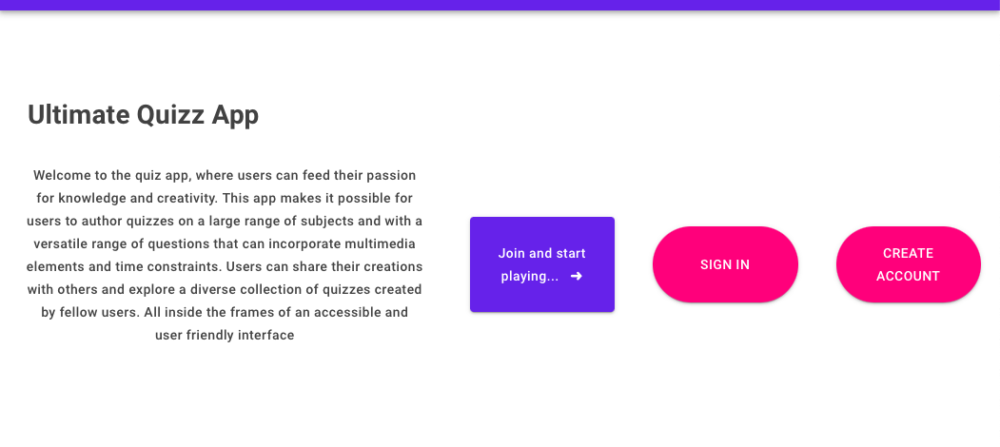

# Ultimate Quizz App

## UI

## Description

This is a full-stack quiz application built with Blazor and ASP.NET Core where users can register, log in and create or answer quizzes as well as share them with others. Quizzes can be created with a variable number of questions and each question can, along with text content, include image or video content and have multiple-choice or free-text answer format. Quiz-creators can set time limits for answering questions so that quiz-takers scores are effected based on how fast questions are answered. It is also possible for quiz-creators to see who has answered their quizzes and their respective scores. 

---

## Technologies used

 - ASP.NET Core
 - C#
 - Blazor 
 - JWT (Authorization)
 - Entity Framework Core
 - SQL 
 - Bootstrap

---

## Architecture

The app is abstracted into Controller, IService and Service-layers which compartmentalizes responsibilities and enhances maintainability of code. Data is transmitted from the server to the Razor client via shared view models, which makes communication effective and prevents exposure of data. 

Client side logic is implemented using Blazor and the app has a user-friendly interface that offers intuitive navigation. The database schema is implemented using Entity framework core with migrations and code first.

---

## User experience, design, performance and scalability

The app has a user-friendly interface design which makes it easy for users to create, publish and participate in quizzes. Users also have great flexibility in creating their quizzes, with the ability to add images and videos to questions, set time limits and choose answer options. 

The architectural choice from Controller to IGameService to GameService streamlines code management and promotes scalability. Abstraction layers are effective when it comes to ensuring maintainability, scalability and code reusability. By encapsulating various components within abstraction layers such as services housed in a Services folder and corresponding interfaces (IServices) in an Interface folder the application has a modular and organized design. This separation also follows the Interface Segregation Principle (ISP) of SOLID design principles. This makes it easier for developers to maintain, extend and optimize the application's functionality in the future without compromising its integrity. Abstraction layers also creates effective integration of business logic and data access. 

The database design built with EF core with migrations promotes scalability and is able to handle increasing data volumes and user traffic over time.
